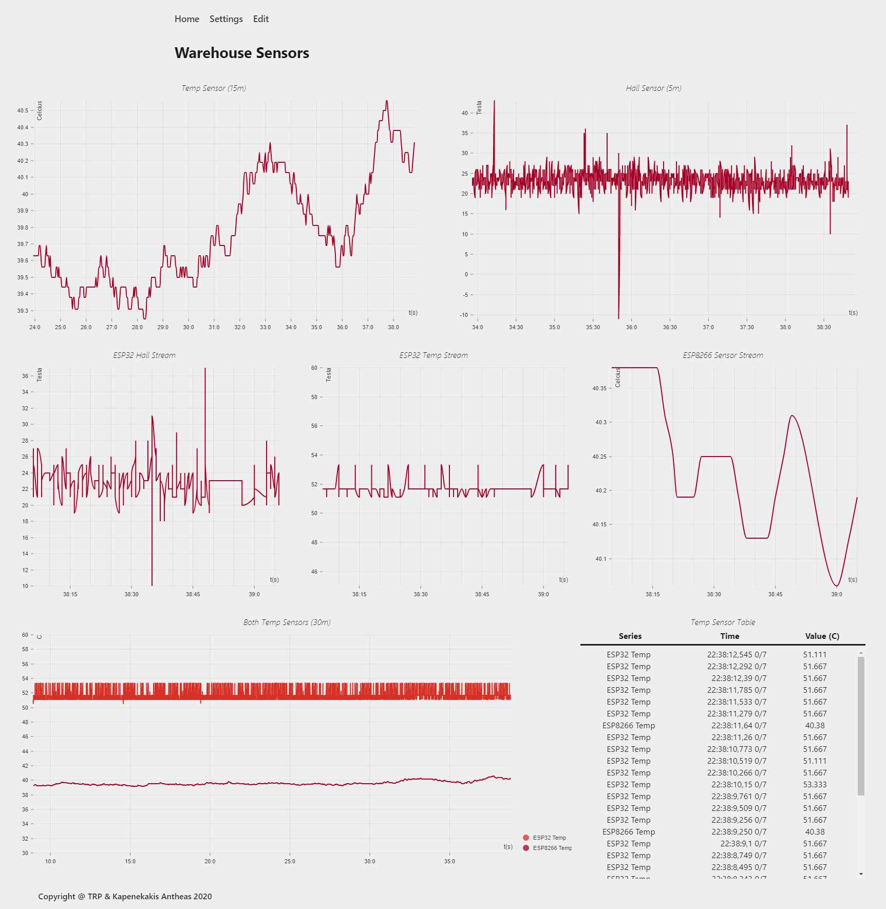

# MQTT Persistent Dashboard with React and InfluxDB 
A concept project for monitoring and injesting data from MQTT sensors.
This concept was created to test the viability of combining MQTT, react, and the InfluxDB
database to persist and display sensor data with streaming support.
Due to time constraints, only a prototype was built, missing key features, such as a
timeline with playback, customisable timeframes, a dashboard builder, alerts, configuration
storage etc.
However, if you so desire, with minimal modifications you could create your own custom dashboard
and display your own sensor data (even though the builder hasn't been created).



# Description
In the heart of this project lies the Eclipse Mosquitto broker.
The user can connect multiple MQTT sensors to that broker by supplying them
its credentials.
Then, provided the sensors use a specific publishing format (`sensors/$group/$client/$sensor/$unit`)
their data will be timestamped and saved automatically to a InfluxDB instance.
This requires no configuration by the user, sensors are completely plug and play.
A lightweight python api connects to both InfluxDB and the Broker and provides the frontend
with access to historical data and a websocket subscription for streaming directly from the MQTT
broker.

With a special `/discovery` endpoint, the frontend can ask the backend for sensors which
have been recorded lately.
Then, in the (future) builder the user can pick a sensor without knowing its exact publishing
endpoint.
Also, since with each point we store its `group`, `client`, `sensor`, and `unit` type we can average
the data for any of these tags.
For example, if the `group` refers to a room in a factory, and we pin `sensor` to temperature, by averaging the `client`, we could find the average temperature of the room.
Storing separate tags for the data doesn't increase cardinality or storage consumption since
they are only stored once for each time series by the InfluxDB.

## Tech Stack
The frontend is a React app with a redux model for its configuration.
For websockets the socket.io protocol is used.
To ingest and persist data from the broker, InfluxData's telegraf is used.
This could be changed in the future.
For user convenience, the docker-compose file contains a Cronograf instance
to test out queries.
To build the frontend files, webpack is used with a node container
which will build and watch the files on startup.
To host the files and provide reverse proxying for the api an NGINX instance is used.

# Project Structure
## API
The API providing data to the frontend is built with Python and Flask.
The file `db.py` contains an abstraction for communicating with the InfluxDB database,
using their new driver and Flux, so as to be futureproofed.
The file `entry.py` contains the API endpoints and the websocket code.
To enable streaming, it connects to the broker and subscribes to `sensors/#`.
Then, whenever it receives data from a sensor, it forwards it to the Socket.io room 
`sensors/$group/$client/$sensor/$unit`, which sends it to the clients in that room.
When a dashboard wants to receive streaming data from a sensor it requests to be
added to that room.
That way, Socket.io completely handles client subscriptions and there are no memory leaks.
If a client disconnects, Socket.io will remove it from all of its rooms automatically. 

## Frontend
The frontend is built using standard practices for a React app and with Typescript.
It is split into four folders: `components`, `pages`, `styles`, and `store`.
 - `components` contains the custom react components (for now the implemented Graphs)
 - `pages` contains the app Pages (Dashboard and Overview are implemented for now)
 - `styles` contains the SASS Styles fro the project which are split into partials
   (for components) and pages (for pages). The rest is standard SASS.
 - `store` contains the model of the app, the types, and the api abstraction.

### Store
In the redux store only the configuration of the app is stored (Dashboard, preferences).
It would be too slow to attempt to store the graph data in it.
The folders `actions`, `reducers`, and `selectors` contain the app's redux
functions and `types` the app's types.

### API Connection
The `store/api` folder contains the simple, for now, api abstraction that manages the
connection to the API.
It is built using the new react context mechanic so the Dashboard subcomponents can
access an instance of it.
They can then submit a callback with their graph information and start receiving data.
The data skips the redux store and is saved directly to their state using hooks
for performance.

On startup, as the Graphs register themselves to the API provider, the provider 
will make a Get request to fill them with data.
Then, depending on the graph timespan, it will either register them for polling
or for streaming.
It is impractical to stream graphs that span hours and it would be too slow to
refresh them at that speed, so they are always polled.
Data that span minutes can either be streamed, or if disabled, polled as well.

## Graphs
For now, only two types of graphs are built.
Line graphs and table "graphs".
They both support multiple sensors and will adjust if more than one is added,
adding a legend (line graph) or a series column (table).
The line graphs also adjust the tick marks according to the width,
and can set a title, min, max, adjustable timespans, and measurement unit.

# Dashboard Concept
## Graph
A Graph is a component that displays the data of one or more sensors.
It could be a graph, a table, or a guage.
To define one, we can use the following data:

**Warning: Only specific Time Scales are supported for now: 
1m, 5m, 15m, 30m, 1h, 6h, 1d, 1w, 1o, 6o, 1y, all**

```
export interface Graph {
  id: string;
  name: string;
  type: "bump" | "heatmap" | "line" | "gauge" | "table";
  colors?: string;

  min?: number;
  max?: number;
  scale: TimescaleType;
  unit: string;

  sensors: Sensor[];
}

export interface Sensor {
  group?: string;
  client?: string;
  sensor?: string;
  unit?: string;
  topic?: string;

  name: string;
  color?: string;
}
```

## Dashboard
On an abstract level, a dashboard is a collection of Graph (components).
To make it easier for novice users to build let's make that more specific.
A Dashboard is a collection of rows.
Each one of those rows can contain one or more graphs.
The User can then specify the relative width of those graphs and the height of the row.
That allows the user to build most of the dashboard configurations he could want in an easy
manner.

To simplify even more, let's create three types of rows, depending on how many graphs they
can contain (1, 2, 3) and fix the possible widths of graphs to multiples of 30% and 50%.
It is simple to deduce that rows with 1 graph and 3 graphs can have a single configuration
(1 graph: 100% and 3 graph: 3*30%).
For rows with two graphs we have three configurations: 50-50, 30-60, and 60-30.
CSS sets the relative widths and with media queries could modify them 
to make the site mobile friendly.

A row is defined as such
```
export interface Row {
  type: string;
}

export interface RowSingle extends Row {
  type: "single";
  graph: Graph;
}

export interface RowDouble extends Row {
  type: "double";
  split: "oox" | "oxx" | "ox";
  graph1: Graph;
  graph2: Graph;
}

export interface RowTriple extends Row {
  type: "triple";
  graph1: Graph;
  graph2: Graph;
  graph3: Graph;
}
```

A dashboard is simply a collection of rows with a name
and timeline data (which aren't honored yet).
When they are, `span` will override the timespan in the graphs,
allowing the user to show larger spans of time,
`time` will set the time up to which the dashboard goes
(it is pinned to the current time for now) and 
`streaming` will control whether streaming is enabled.

```
export interface Dashboard {
  id: string;
  name: string;
  rows: Row[];

  streaming: boolean;
  span: number;
  time: number;
}
```

# How to use
In its current state, the project features a proper docker-compose file which sets up, builds 
the project and opens up the proper ports.
Launch and build the project by running `docker-compose up -d --build`.
After the Gateway 500 error goes away the project is built and ready to use.

## Sensors
To use, configure your sensors to connect to your WIFI and broker and publish to
`sensors/$group/$client/$sensor/$unit`, where:
 - group: refers to a grouping of publishing devices (ex. ESP32s) by room, place, equipment or area.
 - client: identifies a device that broadcasts in the group (ex. one of the ESP32s)
 - sensor: since devices can have multiple sensors, this endpoint identifies the sensor (ex. temp1)
 - unit: sensors may have multiple values as well (such as humidity and temperature),
   so you can specify a different one, or just set to value.

If you are unsure for what firmware or sensors to use, checkout ESPEasy for ESP32 and ESP8266
boards, which will be simple to configure to output to this format.
If you want something simpler and less configurable, the folder `sensor/` contains an Arduino
sketch which will publish an ESP32's built in temp sensor and hall data to the broker.

## Dashboard Creation
This project is an early prototype.
To create your own custom dashboards you can modify the `client/store/test.ts` file
with your own dashboards.
Currently, it has the one that is shown above.

# License
This project features the MIT license, so you can use it however you want, provided
you follow its terms.